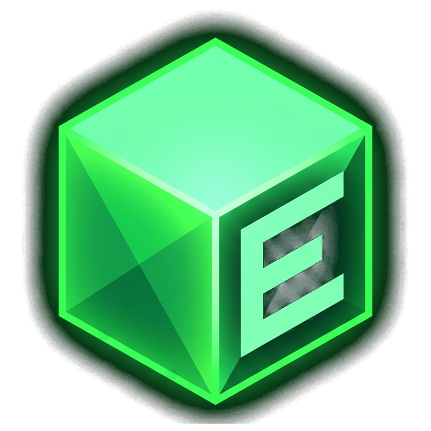

# ⚡ EzClient

  

  <strong>Der ultimative moderne Minecraft Client & High-Performance Launcher</strong> 
  Blitzschneller nativer Spielstart · Nahtlose Mod- & Modpack-Bibliothek · Animierte Capes · Connected Glass · Ingame-Module

  
  
  
  
  

---

## ✨ Features & Highlights

### ⚡ High-Performance Direct Launch
- **Nativer Schnellstart:** Startet Minecraft ohne Umwege direkt über die interne Java-Engine – spürbar schneller als herkömmliche Launcher.
- **FPS- & Speicher-Optimierung:** Maßgeschneiderte Java-Flags, GC-Tuning und moderne Speicherverwaltung für maximale FPS und minimale Latenzen.

### 🎮 Aktive Minecraft 26.x Unterstützung
- **Maßgeschneiderte Client-Engine:** Volle, dedizierte Entwicklung für die moderne Minecraft **`26.x`** Familie (`26.1`, `26.1.1` und `26.2`).
- **Umfassender Launcher-Support:** Unterstützt darüber hinaus alle Versionen von `1.8.9` bis `26.x` für **Vanilla**, **Fabric** und **Forge**.

### 🪟 Clear Glass (Connected Textures)
- **Makellose Glasflächen:** Zusammenhängende Glasblöcke blenden Innenkanten vollautomatisch aus.
- **Präzise Kanten:** Dynamische Kantenerkennung sorgt dafür, dass auch bei gestapelten Glasblöcken keine Pixellücken oder Risse an den Außenrändern entstehen.
- **Sofortige Aktivierung:** Das Umschalten im Menü lädt Chunks sofort in Echtzeit neu – kein manuelles F3+A nötig!

### 📦 Integrierte Mod- & Modpack-Bibliothek
- **Modrinth & CurseForge vereint:** Riesige Auswahl an Mods, Shadern und Resource Packs direkt durchsuchbar.
- **1-Klick-Installation:** Mods mit einem Klick installieren, umschalten oder aktualisieren.
- **Modpack-Unterstützung:** Bei Modpacks wird vollautomatisch ein neues, vorkonfiguriertes Profil mit allen benötigten Mods und Versionen angelegt.
- **Infinite Scrolling & smarte Filter:** Flüssiges Nachladen mit pulsierender Animation und automatischer Erkennung fehlender Shader-Loader (z. B. Iris).

### 🎭 Capes, Skins & 3D-Vorschau
- **Animierte Capes:** Unterstützt animierte Capes (GIF/PNG) mit Live-Wiedergabe im Launcher und im Spiel über den Community-Server.
- **Integrierter Cape-Editor:** Eigenes Cape pixelgenau zuschneiden, skalieren, positionieren und direkt anwenden.
- **Interaktive 3D-Vorschau:** Betrachte deinen Skin und dein Cape vor dem Spielstart aus jedem Blickwinkel.

### 🛡️ Integrierte Ingame-Module & HUDs
- **Umfangreiche PvP- & QoL-Module:** ArmorStatus, Keystrokes, Coordinates, CPS- & FPS-Counter, Ping, DayCounter, Fullbright, MotionBlur, TimeWeather, AutoGG, Hitboxen, ItemPhysics, DamageTint, Reach, ComboCounter, BossBar, FovChanger, Custom Crosshair und Waypoints.
- **Ingame-HUD-Editor:** Öffne das Menü im Spiel einfach mit **`RSHIFT`** (Rechte Shift-Taste), um alle Module frei zu verschieben und anzupassen.

### 🩺 Crash Doctor & Live Logs
- **Intelligente Diagnose:** Bei Abstürzen oder inkompatiblen Mods schlägt der Crash Doctor sofort die Ursache vor und bietet 1-Klick-Lösungen an.
- **Live-Logs-Fenster:** Behalte Minecraft-Logs in Echtzeit im Blick – mit praktischer Farbkodierung und Suchfunktion.

### 📥 Profile Creation Hub
- **Schneller Einstieg:** Wähle zwischen dem Schnell-Assistenten, eigenen Profilen, Modpacks oder importiere bestehende Profile aus dem NoRiskClient mit allen Mods und Einstellungen.

---

## 📥 Download & Installation

1. Lade dir die neueste **`EzClient-Setup.exe`** aus den [Releases](https://github.com/LuigiLetsPlay/EzClient/releases) herunter.
2. Starte das Setup und folge den Anweisungen.
3. **Hinweis zu Windows Smart App Control / SmartScreen:**  
   EzClient ist ein unabhängiges Open-Source-Projekt. Das Setup registriert das digitale Entwicklerzertifikat (*"Luigi / EzClient"*) automatisch als vertrauenswürdigen Herausgeber. Bestätige beim Setup die Abfrage für das Zertifikat, damit Windows die Ausführung dauerhaft uneingeschränkt erlaubt.

---

## 📜 Lizenz

EzClient ist lizenziert unter der **EzClient License** (persönliche, nicht-kommerzielle Nutzung). Details siehe [LICENSE](LICENSE).
